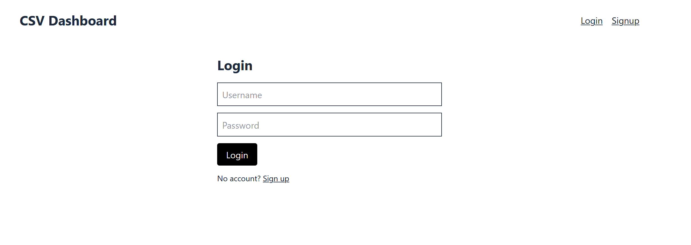
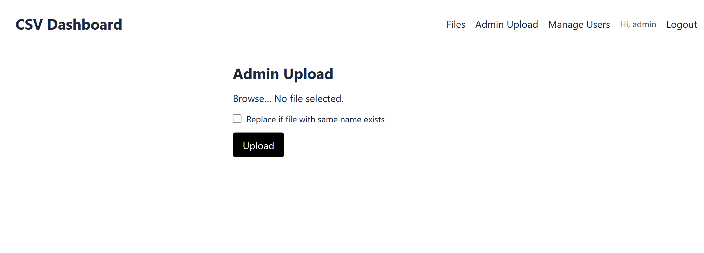
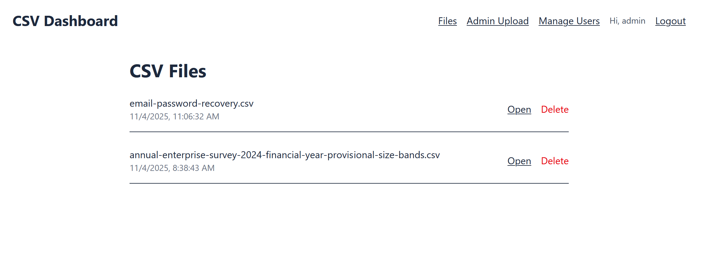
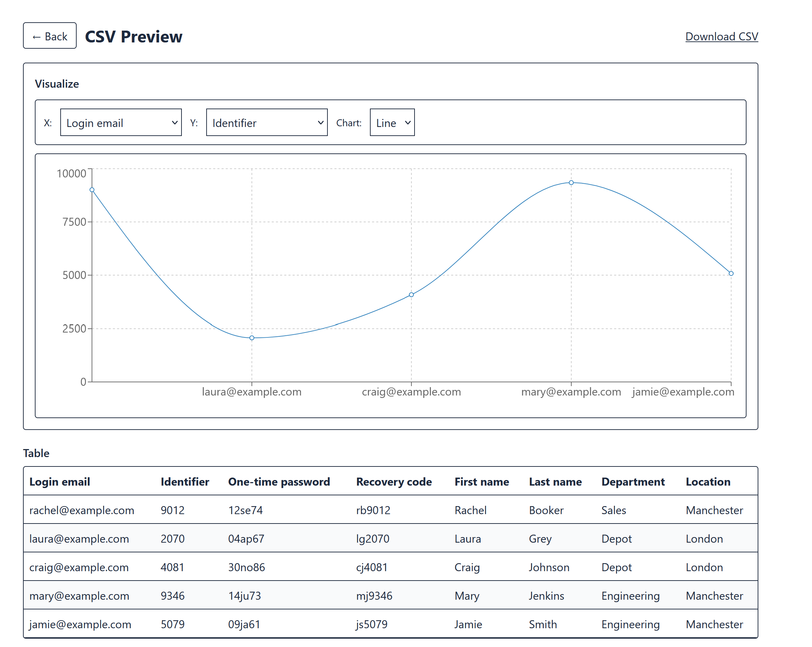
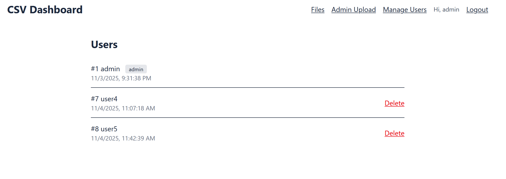

# 🧩 CSV Dashboard – Full-Stack Web App

A secure, full-stack web application that lets users **upload, preview, and visualize CSV files**, while **admins** can manage users and uploaded datasets.  
Built with **FastAPI**, **PostgreSQL**, and **React + TypeScript**.

---

## 🚀 Features

### 👤 Authentication
- JWT-based login and signup  
- Secure password hashing  
- Role-based access (admin vs user)

### 📊 CSV Management
- Upload CSV files (admin only)  
- Preview table data directly in the browser  
- Visualize CSV columns with line / bar charts  
- Download CSVs again later

### 🧑‍💻 Admin Dashboard
- View / delete users  
- Delete uploaded files  
- Replace or overwrite CSVs safely

---

## 🧠 Tech Stack

| Layer | Technology | Purpose |
|:------|:------------|:---------|
| **Frontend** | React + TypeScript • Vite • Tailwind CSS | UI / routing / charts |
| **Backend** | FastAPI (Python) | API / auth / business logic |
| **Database** | PostgreSQL (via SQLAlchemy ORM) | Persistent storage |
| **Auth** | JWT | Token-based authentication |
| **Visualization** | Recharts | Interactive data charts |

## 🖼️ App Screenshots

### 🔐 Login Page

### 📤 Admin CSV Upload

### 📊 CSV File Viewer (with Chart)

### 👥 Admin User Management

